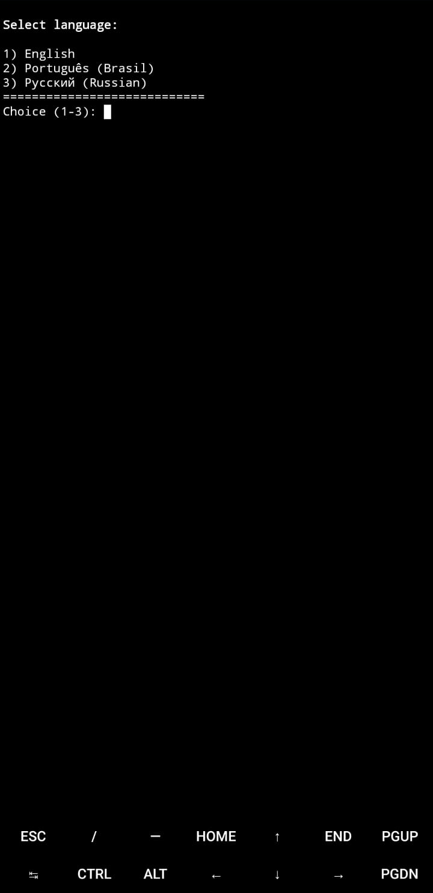
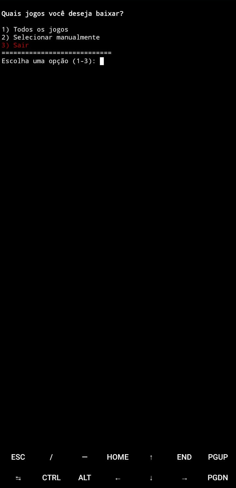
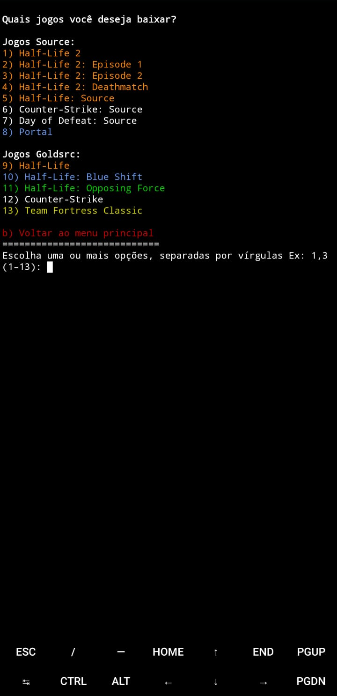

<div align="right">
    <a href="../../README.md" target="_blank">
        
    </a>
    <a href="Russian.md" target="_blank">
        
    </a>
</div>

<div align="center">


</div>

[](https://git.io/typing-svg)

[](https://discord.gg/tVNv6SNZZT)

Este projeto tem como objetivo facilitar o download de jogos da Valve no Android de forma legal e documentar como jogar eles.

Vejam a [Documentação](../PT-BR/Documentação.md)

`valve-on-android` é uma ferramenta para Termux que utiliza o [TermuxDepotDownloader](https://github.com/TheKingFireS/TermuxDepotDownloader) feito por [TheKingFireS](https://github.com/TheKingFireS)

## Funções:
- Suporte a múltiplos idiomas na interface do script.
- Download automático do DepotDownloader caso não esteja instalado.
- Suporte para baixar os seguintes jogos:
  - Half-Life 2
  - Half-Life 2: Episode 1
  - Half-Life 2: Episode 2
  - Half-Life 2: Deathmatch
  - Half-Life: Source
  - Counter-Strike: Source
  - Day of Defeat: Source
  - Portal
  - Half-Life
  - Half-Life: Blue Shift
  - Half-Life: Opposing Force
  - Counter-Strike
  - Team Fortress Classic
- Suporte para baixar pacotes de idioma oficiais da Steam.
- Suporte para baixar pacotes de idioma da comunidade (nossos projetos e outras traduções — atualmente oculto no script).

> [!WARNING]
> O TermuxDepotDownloader não é recomendado de se utilizar no Termux da Play Store, use o do F-droid ou do GitHub.
> Aviso retirado do prório TermuxDepotDownloader:
> "A versão da Google Play Store na verdade não está atualizada,
> é apenas um fork da mesma versão com alguns testes para
> cumprir a rígida política da Play Store.
> Veja mais informações no anúncio dos desenvolvedores do Termux na Google Play:
> https://github.com/termux/termux-app/discussions/4000
> A equipe de desenvolvimento do Termux recomenda usar o GitHub ou
> F-Droid em vez da versão da Google Play Store.
> Além disso, o script não é testado na versão da Play Store,
> então você pode encontrar problemas que não ocorrem nas versões GH/FD."

-----
Copie e cole o comando abaixo no Termux para usar o script:
```
curl -LO "https://raw.githubusercontent.com/source-br/Valve-on-android/main/valve-on-android.sh" && chmod +x installgames.sh && ./installgames.sh
```

<div align="center">
  
  
  
</div>


