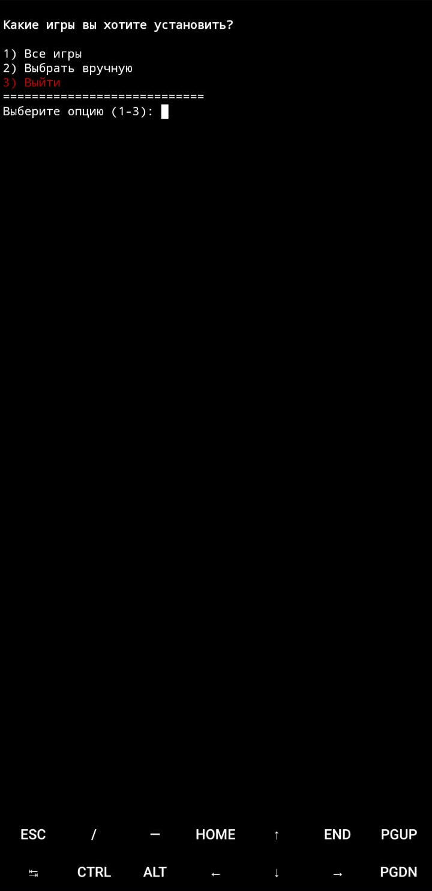
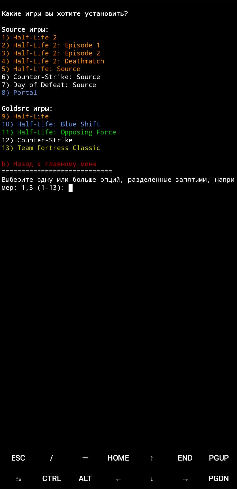

<div align="right">
    <a href="Brazilian.md" target="_blank">
        
    </a>
    <a href="../../README.md" target="_blank">
        
    </a>
</div>

<div align="center">


</div>

[](https://git.io/typing-svg)

[](https://discord.gg/tVNv6SNZZT)

Этот проект направлен на упрощение законной загрузки игр от Valve на Android.

`valve-on-android` — это инструмент для Termux, использующий [TermuxDepotDownloader](https://github.com/TheKingFireS/TermuxDepotDownloader) от [TheKingFireS](https://github.com/TheKingFireS)

[Termux](https://github.com/termux/termux-app)

## Особенности:

* Поддержка нескольких языков в интерфейсе скрипта.
* Автоматическая загрузка DepotDownloader, если он не установлен.
* Поддержка загрузки следующих игр:

  * Half-Life 2
  * Half-Life 2: Episode 1
  * Half-Life 2: Episode 2
  * Half-Life 2: Deathmatch
  * Half-Life: Source
  * Counter-Strike: Source
  * Day of Defeat: Source
  * Portal
  * Half-Life
  * Half-Life: Blue Shift
  * Half-Life: Opposing Force
  * Counter-Strike
  * Team Fortress Classic

* Поддержка загрузки официальных языковых пакетов из Steam.
* Поддержка загрузки языковых пакетов от сообщества (наши переводы и сторонние — пока скрыты в скрипте).

> [!WARNING]
> TermuxDepotDownloader не рекомендуется для использования в версии Termux из Google Play Store. Используйте версию из F-Droid или GitHub.  
>  
> Предупреждение из самого TermuxDepotDownloader:  
> "Версия из Google Play Store на самом деле не обновляется,  
> это всего лишь форк той же версии с некоторыми тестами,  
> чтобы соответствовать строгой политике Google Play Store.  
>  
> Подробнее читайте в объявлении разработчиков Termux:  
> https://github.com/termux/termux-app/discussions/4000  
> Команда Termux рекомендует использовать версии из GitHub  
> или F-Droid вместо версии из Google Play.  
> Также скрипт не тестировался на версии из Google Play,  
> поэтому вы можете столкнуться с проблемами, которых нет в других версиях."

-----
Скопируйте и вставьте следующую команду в Termux для запуска скрипта:
```
curl -LO "https://raw.githubusercontent.com/source-br/Valve-on-android/main/valve-on-android.sh" && chmod +x valve-on-android.sh && ./valve-on-android.sh
```

<div align="center">
  
  
  
</div>


