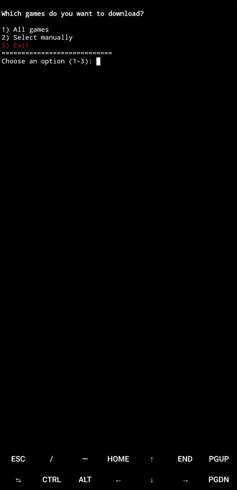
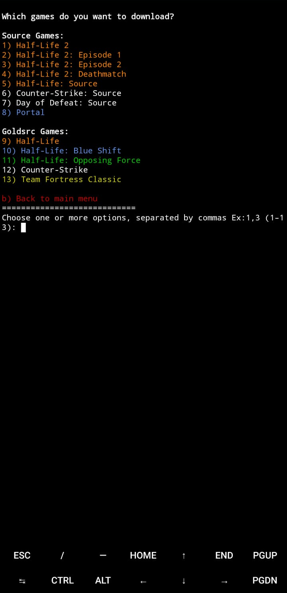

<div align="right">
    <a href="Docs/Readmes/Brazilian.md" target="_blank">
        
    </a>
    <a href="Docs/Readmes/Russian.md" target="_blank">
        
    </a>
</div>

<div align="center">


</div>

[](https://git.io/typing-svg)

[](https://discord.gg/tVNv6SNZZT)

This project aims to make it easier to download Valve games on Android legally.

`valve-on-android` is a Termux tool that uses [TermuxDepotDownloader](https://github.com/TheKingFireS/TermuxDepotDownloader) by [TheKingFireS](https://github.com/TheKingFireS)

[Termux](https://github.com/termux/termux-app)

## Features:
* Multi-language support in the script interface.
* Automatic download of DepotDownloader if not installed.
* Support for downloading the following games:
  * Half-Life 2
  * Half-Life 2: Episode 1
  * Half-Life 2: Episode 2
  * Half-Life 2: Deathmatch
  * Half-Life: Source
  * Counter-Strike: Source
  * Day of Defeat: Source
  * Portal
  * Half-Life
  * Half-Life: Blue Shift
  * Half-Life: Opposing Force
  * Counter-Strike
  * Team Fortress Classic
* Support for downloading official Steam language packs.
* Support for downloading community language packs (our projects and other translations — currently hidden in the script).

> [!WARNING]
> TermuxDepotDownloader is not recommended for use on the Google Play Store version of Termux.  
> Use the F-Droid or GitHub version instead.  
> Download link for github version:
> http://github.com/termux/termux-app/releases/download/v0.118.3/termux-app_v0.118.3+github-debug_universal.apk
> Warning taken from TermuxDepotDownloader itself:  
> "Google Play Store version is actually not updated,  
> it's just a fork of the same version with some tests to  
> conform to Google Play Store's strict policy.  
>
> See more info in Termux dev's Google Play announcement:  
> https://github.com/termux/termux-app/discussions/4000  
> Termux dev team recommends using GitHub or  
> F-Droid instead of the Google Play Store version.  
> Also, the script is not tested on the Play Store version,  
> so you may encounter issues not present in GH/FD versions."

-----
Copy and paste this code in Termux to use this script:
```
curl -LO "https://raw.githubusercontent.com/source-br/Valve-on-android/main/valve-on-android.sh" && chmod +x valve-on-android.sh && ./valve-on-android.sh
```

<div align="center">
  
  
  
</div>


